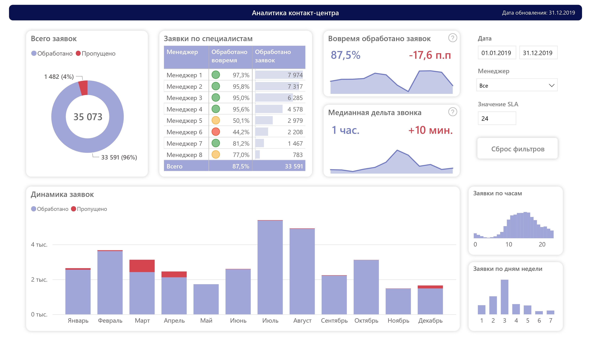
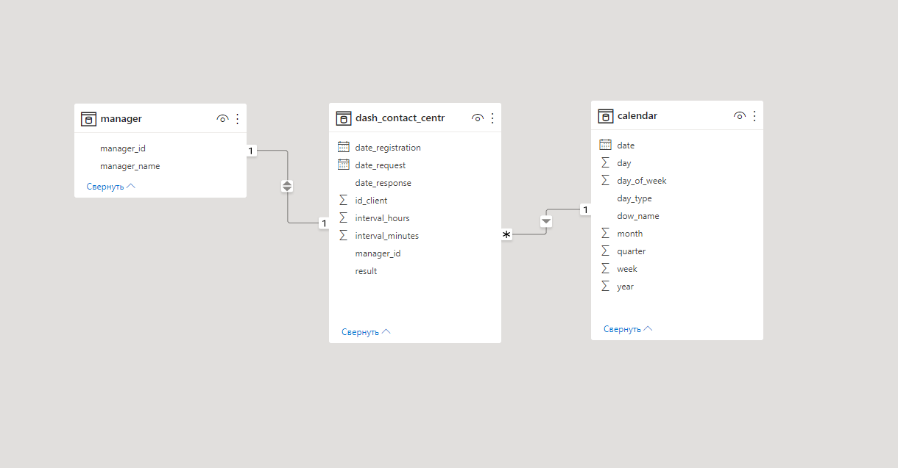

# Дашборд «Операционная аналитика контакт-центра за 2019 год»

## Введение
Дашборд «Операционная аналитика контакт-центра за 2019 год» разработан для анализа ключевых показателей эффективности работы контакт-центра. Он позволяет отслеживать метрики, связанные с обработкой заявок, временем ответа и качеством обслуживания клиентов.

---

## Техническое описание

### Платформа
Дашборд создан с использованием BI-системы **Power BI**, которая обеспечивает интуитивно понятную визуализацию данных и гибкость в настройке аналитических отчетов.

### Источники данных и модель

Для работы дашборда была разработана **витрина данных** в **PostgreSQL**, которая агрегирует информацию из различных источников. Подключение к витрине осуществляется через **Power Query**, что позволяет автоматизировать процесс обновления данных.

Дополнительно были подготовлены:
- **Бизнес-справочники** для формирования **OLAP-куба**, что обеспечивает многомерный анализ данных.
- **Календарь** для расширения аналитических возможностей, таких как анализ временных трендов и сезонности.

---

## Планы по развитию ETL-процесса

В настоящее время для взаимодействия с базой данных используется **DBeaver**. Однако в ближайшее время планируется миграция ETL-процессов на **Python** для повышения гибкости и производительности. Основные инструменты, которые будут задействованы:
- **SQLAlchemy** — для подключения к базе данных.
- **Pandas** — для обработки и трансформации данных.

Начальные этапы разработки уже можно увидеть в [этом ноутбуке]().

---

## Метрики

### Фактические метрики
- **Заявки (шт)**: Общее количество поступивших заявок.
- **Обработанные заявки (шт)**: Количество заявок, на которые менеджеры дали ответ.
- **Заявки без ответа (шт)**: Количество заявок, оставшихся без ответа.
- **Дельта звонка (час)**: Время, прошедшее с момента регистрации заявки до ответа менеджера.
- **Заявки обработаны вовремя (шт)**: Количество заявок, обработанных в течение 24 часов.
- **Заявки обработаны с опозданием (шт)**: Количество заявок, обработанных позже 24 часов.

### Расчетные метрики
- **Доля вовремя обработанных заявок**: Отношение количества вовремя обработанных заявок к общему количеству заявок.  
  Формула: `Обработанные заявки / Заявки`.
- **Медианная дельта звонка**: Медианное значение времени ответа для всех обработанных заявок.

---

## Заключение
Дашборд «Операционная аналитика контакт-центра за 2019 год» предоставляет удобный инструмент для мониторинга и анализа ключевых показателей работы контакт-центра. Дальнейшее внедрение новых технологий, таких как Python и Pandas, позволит еще больше автоматизировать процессы и повысить точность аналитики.
